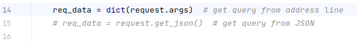
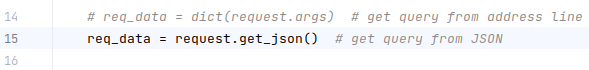

<a name="readme-top"></a>

# Regex-filter-map

#### Flask server for processing Apache logs using CURL

&nbsp;
<!-- TABLE OF CONTENTS -->
<details>
  <summary>Table of Contents</summary>
  <ol>
    <li>
      <a href="#about-the-project">About the project</a>
      <ul>
        <li><a href="#features">Features</a></li>
        <li><a href="#details">Details</a></li>
      </ul>
    </li>
    <li>
      <a href="#getting-started">Getting started</a>
      <ul>
        <li><a href="#dependencies">Dependencies</a></li>
        <li><a href="#installation">Installation</a></li>
      </ul>
    </li>
    <li>
      <a href="#usage">Usage</a>
      <ul>
        <li><a href="#query-string">Query string</a></li>
        <li><a href="#json-format">JSON format</a></li>
      </ul>
    </li>
    <li><a href="#contact">Contact</a></li>
  </ol>
</details>


<!-- ABOUT THE PROJECT -->
## About The Project

A developer quite often needs to process, e.g. find, convert, sort, etc. large files with the same structure. \
For example: CSV file with data about users or file with records of server requests (log-file). \
This application demonstrates a similar functionality and is a Flask server that:

* can process any ASCII file.
* uses the log file of the Apache web server that contains 10,000 lines.
* handles the POST-request
* available on [/perform_query](http://localhost:5000/perform_query)
* takes from 1 to 7 args, when 1st - is file name and the rest are key-value pairs, like:
  ```
  http://localhost:5000/perform_query?file_name=some_file.log&cmd1=cmd_name_1&value1=abc&cmd2=cmd_name_2&value2=xyz&cmd3=cmd_name_3&value3=555
  ```
All data files should be located in `/data` folder in the project root. \
Examples in this document use `CURL` as a query execution tool from the command prompt. Any other one can also be
  used, e.g. `Postman` software.

<p align="right">(<a href="#readme-top">back to top</a>)</p>

### Features

* Query keys are supported: \
  `file_name`, `cmd1`, `cmd2`, `cmd3`, `value1`, `value2`, `value3`
* Query values of _cmd&lt;n&gt;_ key are supported: \
  `filter`, `map`, `unique`, `sort`, `limit`, `regex`
* Types of `value<n>` key are supported:
    * `filter`: `<str>`, `<int>`
    * `map`, `limit`: `<int>`
    * `regex`: `<str>`
    * `unique`: not required
    * `sort`: `<str>` or not required

#### Notes:

* Some or all key-value pairs may be omitted, e.g. `cmd3` & `value3` as in example below:
  ```sh
    http://localhost:5000/perform_query?file_name=apache_logs.txt&cmd1=filter&value1=POST&cmd2=map&value2=0
  ```
* For the `sort` command use `asc` as `value<n>` value to sort alphabetically.

<p align="right">(<a href="#readme-top">back to top</a>)</p>

### Details

* Input file can be processed using the following functions:
    * `filter()` with `lambda`
    * `map()` with `lambda`
    * `set()` for unique values
    * `sorted()` for sort values
    * slices `list[:n]` to limit the result to `n` items
    * `re.findall()` with `filter` & `lambda` to give the result by regex
* Validation of input data is used with Try-Except statement in the perform_query() view-function
* You can use the `mypy` lib as a static type checker
  ```sh
  mypy app.py
  ```

<p align="right">(<a href="#readme-top">back to top</a>)</p>


<!-- GETTING STARTED -->
## Getting Started

### Dependencies

* Windows 10 version 1803, Mac OS X 10.11, Ubuntu 18.04
* x86 64-bit CPU (Intel / AMD architecture)
* 4 GB RAM
* 5 GB free disk space
* Python 3.8 or higher

### Installation

1. Clone this repo
   ```sh
   git clone https://github.com/Doom-2/Regex-filter-map.git
   ```
2. Install dependencies
   ```sh
   pip install -r requirements.txt` in terminal
   ```
3. Run Flask server
   ```sh
   python3 app.py
   ```

4. Execute different POST http-requests using the examples bellow, including your own

<p align="right">(<a href="#readme-top">back to top</a>)</p>


<!-- USAGE EXAMPLES -->
## Usage

Requests can be executed from command line (Bash, PowerShell) using `CURL` tool or via `Postman` software.
> There are 2 ways to perform requests: data passing as a query string or in JSON format.

### Query string

* Make sure the line 14 in `app.py` is uncommented, while line 15 is commented out.

  

* Execute the following scripts in command prompt and see the result:
  * ```sh
    curl -X POST "http://localhost:5000/perform_query?file_name=apache_logs.txt&cmd1=filter&value1=POST&cmd2=map&value2=0" | json_pp
    ```
  * ```sh
    curl -X POST "http://localhost:5000/perform_query?file_name=apache_logs.txt&cmd1=limit&value1=232&cmd2=filter&value2=Ubuntu&cmd3=map&value3=0" | json_pp
    ```
  * ```sh
    curl -X POST "http://localhost:5000/perform_query?file_name=apache_logs.txt&cmd1=map&value1=5&cmd2=unique" | json_pp
    ```

<p align="right">(<a href="#readme-top">back to top</a>)</p>

### JSON format

* Make sure the line 15 in `app.py` is uncommented, while line 14 is commented out.

  

* Execute the following scripts in command prompt and see the result:
  * ```sh
    curl -X POST http://localhost:5000/perform_query \
    -H 'Content-Type: application/json' \
    -d '{
    "file_name": "apache_logs.txt",
    "cmd1": "limit",
    "value1": 150,
    "cmd2": "filter",
    "value2": "190"
    }' | json_pp
    ```
  * ```sh
    curl -X POST http://localhost:5000/perform_query \
    -H 'Content-Type: application/json' \
    -d '{
    "file_name": "apache_logs.txt",
    "cmd1": "map",
    "value1": "5",
    "cmd2": "unique",
    "value2": 0,
    "cmd3": "sort"
    }' | json_pp
    ``` 
  * ```sh
    curl -X POST http://localhost:5000/perform_query \
    -H 'Content-Type: application/json' \
    -d '{
    "file_name": "apache_logs.txt",
    "cmd1": "regex",
    "value1": "files\/\\S+\\.exe",
    "cmd2": "map",
    "value2": 0,
    "cmd3": "unique"
    }' | json_pp
    ```

<p align="right">(<a href="#readme-top">back to top</a>)</p>


<!-- CONTACT -->
### Contact

Peter Khramov:  [phramov945@gmail.com](mailto:phramov945@gmail.com)

Project Link: [github.com/doom-2/regex-filter-map](https://github.com/doom-2/regex-filter-map)

<p align="right">(<a href="#readme-top">back to top</a>)</p>