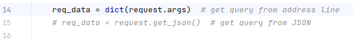
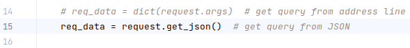

# Regex-parsing-lambda

### Flask server for processing Apache logs 
&nbsp;
#### Program start:
* Install dependencies by running the command `pip install -r requirements.txt` in terminal
* Run the following command from project root `python3 app.py`
* Flask app will be available on `http://localhost:5000`

Requests can be executed from command line (Bash, PowerShell) using `curl` tool or via `Postman` software.
> There are 2 ways to perform requests: data passing as a query string or in JSON format.
* Query string usage:

  * Make sure the line 14 in `app.py` is uncommented, while line 15 is commented out.

    

  * Execute the following scripts in command prompt and see the result:
    * ```
      curl -X POST "http://localhost:5000/perform_query?file_name=apache_logs.txt&cmd1=filter&value1=POST&cmd2=map&value2=0" | json_pp
      ```
    * ```
      curl -X POST "http://localhost:5000/perform_query?file_name=apache_logs.txt&cmd1=limit&value1=232&cmd2=filter&value2=Ubuntu&cmd3=map&value3=0" | json_pp
      ```
    * ```
      curl -X POST "http://localhost:5000/perform_query?file_name=apache_logs.txt&cmd1=map&value1=5&cmd2=unique" | json_pp
      ```
* JSON format usage:

  * Make sure the line 15 in `app.py` is uncommented, while line 14 is commented out.

    

  * Execute the following scripts in command prompt and see the result:
    * ```
      curl -X POST http://localhost:5000/perform_query \
      -H 'Content-Type: application/json' \
      -d '{
      "file_name": "apache_logs.txt",
      "cmd1": "limit",
      "value1": 150,
      "cmd2": "filter",
      "value2": "190"
      }' | json_pp
      ```
    * ```
      curl -X POST http://localhost:5000/perform_query \
      -H 'Content-Type: application/json' \
      -d '{
      "file_name": "apache_logs.txt",
      "cmd1": "map",
      "value1": "5",
      "cmd2": "unique",
      "value2": 0
      }' | json_pp
      ``` 
    * ```
      curl -X POST http://localhost:5000/perform_query \
      -H 'Content-Type: application/json' \
      -d '{
      "file_name": "apache_logs.txt",
      "cmd1": "regex",
      "value1": "images\/\\w+\\.png",
      "cmd2": "limit",
      "value2": 10
      }' | json_pp
      ```

&nbsp;
#### Features:
* Query keys are supported: \
`file_name`, `cmd1`, `cmd2`, `cmd3`, `value1`, `value2`, `value3` 
* Query values of _cmd&lt;n&gt;_ key are supported: \
`filter`, `map`, `unique`, `sort`, `limit`, `regex`
* Types of `value<n>` key are supported:
  * `filter`: `<str>`, `<int>`
  * `map`, `limit`: `<int>`
  * `regex`: `<str>`
  * `unique`: not required
  * `sort`: `<str>` or not required


  _Notes:_
  * Some or all key-value pairs may be omitted, e.g. `cmd3` & `value3` as in example below:
    ```
      file_name=apache_logs.txt&cmd1=filter&value1=POST&cmd2=map&value2=0
    ```
  * For the `sort` command use `asc` as `value<n>` value to sort alphabetically.

&nbsp;
#### Details:
* Input file can be processed using the following functions:
  * `filter()` with `lambda`
  * `map()` with `lambda`
  * `set()` for unique values 
  * `sorted()` for sort values
  * slices `list[:n]` to limit the result to `n` items
  * `re.findall()` with `filter` & `lambda` to give the result by regex
* Validation of input data is used with Try-Except statement in the perform_query() view-function
